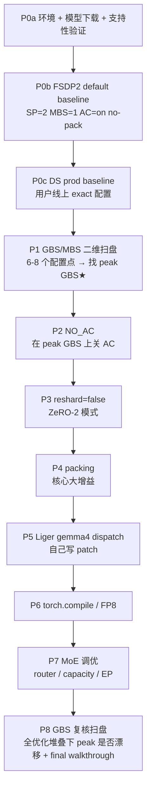

## 0. 目标与约束

**模型**：`google/gemma-4-26B-A4B-it`，MoE（25.2B 总 / 3.8B active，128 expert / 每 token 8），hidden=2816，30 层，vocab=262144，`Gemma4ForConditionalGeneration`（VLM，freeze_vit）

**硬件**：8×H100 80GB SXM，NVSwitch；容器 `fsdp_sft`，transformers 5.5.4，swift 4.2.0.dev0 git main

**后端范围**（根据 recon 结果）：
- **FSDP2** ✅ 主线，按 9 期推进
- **DeepSpeed ZeRO-3** ✅ 只在 Phase 0 用用户线上配置跑一次 baseline，后续不做 per-axis 扫盘
- **Megatron** ❌ `mcore_bridge 1.1.2` 不识别 gemma4，文档单行标记"未支持"

**硬性约束（来自 Gemma4 架构）**：
- `num_global_key_value_heads=2` → **Ulysses SP=2 是硬上限**（SP=4 直接失败，用户已踩过）。FSDP2 侧整个 9 期扫盘固定 SP=2
- 8 GPU / SP=2 → DP=4（dense DP），MoE 的 128 expert 走默认 EP=1（P7 才会动）
- `--use_liger_kernel true` 在 gemma4 上 **silent no-op**（liger_kernel main 至 v0.7.0 都没 `gemma4` dispatch），到 P5 自己写 patch 才会真生效——Phase 0 要实测确认这个现象和 qwen3_5 一致

**硬性要求**：每个数字都是实测，禁止估计。step time / peak mem / peak power / DCGM tc_active / true MFU（nsys 算的）都必须有 run 目录可以回溯。

---

## 1. Dataset & 默认训练参数（FSDP2 轴）

沿用 Qwen3.5 的 setup 保持可比性：
- 数据：`megatron-sft-recipes/sft-data/train.jsonl`（18819 条多轮 VLM，avg 2823 tokens）
- 序列：`max_length=16384`，`truncation_strategy=delete`
- 学习率：`1e-5`，warmup=0.1，cosine decay（bench 测 throughput 用，不关心收敛 LR 具体值）
- 全量微调：`tuner_type=full`，`freeze_vit=true freeze_aligner=true`
- dtype：bf16，`attn_impl=flash_attention_2`
- packing 仅在 Phase 4 之后才开
- GBS/MBS 见 §3（Phase 1 扫完再定）

DS baseline 配置（Phase 0c 直接用用户线上命令，**不改参数**）：
- dataset 指向我们本地的 `sft-data/train.jsonl`（用户线上数据在这台机上没有；其他参数全保留）
- 其余 flag 原封不动：DS ZeRO-3 + offload(opt+param) + SP=2 + MBS=1 + grad_accum=16 + AC=on + `overlap_comm=false` + bucket 1e8 等
- **这次只是复现线上真实 throughput**，不参与 per-axis 扫盘

---

## 2. 文件交付结构

```
megatron-sft-recipes/docs/
    gemma4_optimization_walkthrough.md       # 主 doc，每期追加 1 section（风格参考 fsdp2_optimization_walkthrough.md）
    gemma4_baseline_summary.md               # Phase 0 + Phase 1 完成后产生的双后端 + GBS 一览表
    gemma4_phase_delta_summary.md            # 每期一行（类似 sp_offload_benchmark_summary.md §二）
    gemma4_debug_log.md                      # 所有错误复盘集中册（按期分章节，每个错误有「现象 → 定位 → 修改 → 验证」四段式）

megatron-sft-recipes/scripts/gemma4_opt/     # 每期的启动脚本落盘（可粘贴复现）
    p0_baseline_fsdp2.sh
    p0_baseline_ds_prod.sh
    p1_gbs_sweep.sh
    p2_no_ac.sh
    ...
    p8_gbs_resweep.sh

megatron_output/gemma4_opt/
    p0_baseline_fsdp2/                       # Phase 0 FSDP2 default
        attempts.md                          # 本期所有 run（成功/失败）的时间线索引
        run_01_first_try/                    # 第一次尝试（可能失败）
            cmd.sh                           # 启动该 run 用的完整命令（含所有 env + 展开后的 swift sft/deepspeed CLI）
            stdout.log                       # 完整 stdout + stderr（nohup / tee 留全）
            fsdp_override.json               # 如果用了 override，也存一份
            STATUS                           # 一行文件：SUCCESS / FAILED / PARTIAL + 原因摘要
            report.json                      # SUCCESS 才有
            dcgm_tc.tsv
            v0-*/logging.jsonl
        run_02_after_fix/                    # 改了之后的第二次尝试
            ...
    p0_baseline_ds_prod/
        attempts.md
        run_01/
            cmd.sh                           # 用户线上 exact 命令 + 本机路径替换后的版本
            zero3_offload_nopin.json         # 用户给的 DS config 原文
            stdout.log
            ...
    p1_gbs_sweep/
        attempts.md
        run_01_mbs1_ga1/
            cmd.sh
            stdout.log
            report.json
            ...
        run_02_mbs1_ga2/
        ...
    p2_no_ac/
    ...
    p8_gbs_resweep/
    _summary.md                              # 每期完成后追加一行总结
    ALL_COMMANDS.md                          # 所有期所有 run 的命令汇总（粘贴即跑）
```

每个 phase 目录必含：
- `attempts.md`：时间线索引（**包括失败的 run**），每行 `run_NN/ · 时间戳 · 状态 · 一句话结论`
- `run_NN_<label>/` 每个 run 一个子目录（不管成功失败都保存），固定 4 个文件：
  - `cmd.sh`：**完整启动命令**（env + 展开后的 CLI，直接 `bash cmd.sh` 能原样复跑）
  - `stdout.log`：完整 stdout + stderr（**`tee` 写全，不截断**，失败场景尤其重要）
  - `STATUS`：一行文件 `SUCCESS | FAILED | PARTIAL | BLOCKED` + 原因
  - 任何该 run 用到的 config 文件副本（如 `fsdp_override.json`、`zero3_offload_nopin.json`、`.yaml` 等）
- 如果 `STATUS=SUCCESS`，补 `report.json` + `dcgm_tc.tsv` + `v0-*/logging.jsonl`
- 关键期（P0、P1、P4、P5、P7、P8）的 SUCCESS run 多一份 `rank0.nsys-rep` + `rank0_kernels.csv` + 分类结果

---

## 3. 实验流程总览



---

## 4. Phase 0：环境 + 双后端 baseline

### 0a. 环境准备
- `modelscope download --model google/gemma-4-26B-A4B-it --local_dir /home/ubuntu/.cache/modelscope/models/google/gemma-4-26B-A4B-it`（~50 GB，应该 3-5 min）
- 验证 swift 能加载（不训，只 init）：`swift sft --model <path> --model_type gemma4 --max_steps 1 --tuner_type full --fsdp fsdp2 ...`
- 链 nsys 2025 到 PATH：`docker exec fsdp_sft ln -sf /opt/nvidia/nsight-compute/2025.2.1/host/target-linux-x64/nsys /usr/local/bin/nsys`
- 起 dcgm-exporter（复用 Qwen3.5 一致的 10Hz 配置）
- 复制 Qwen3.5 用过的 `run_with_nsys.sh` + `nsys_classify.py` + `parse_swift_log.py` 到 `megatron-sft-recipes/scripts/benchmark/`（保留到 repo 方便后期人用）

### 0b. FSDP2 default baseline
```
BACKEND=fsdp2 SP=2 MBS=1 GBS=4 (grad_accum=1, dp=4)
NO_AC=false FSDP_RESHARD=true (swift 默认 ZeRO-3)
PACKING=false USE_LIGER=true (实际 silent no-op，记录这个事实)
TOTAL_STEPS=40 WARMUP_BENCH=5
```
产出：`steady step s`、`peak mem GB`、`peak/avg power W`、`DCGM tc_active p50/p99`、`真 MFU (nsys)`、`每步 real tokens`、`loss head/tail`、`NaN 计数`

### 0c. DeepSpeed 线上配置 baseline（一次性，不再扫）
复制用户提供的命令，只改：
- `--model` 指向本机路径
- `--dataset` 指向 `megatron-sft-recipes/sft-data/train.jsonl`
- `--output_dir` 指向 `megatron_output/gemma4_opt/p0_baseline_ds_prod/`
- 加 `--max_steps 40`（本来 `--num_train_epochs 1`，这里截短做 bench）
- `--save_strategy no`（免得 save checkpoint 污染 step time 测量）

其余参数全保留：ZeRO-3 + offload(opt+param) CPU + SP=2 + MBS=1 + grad_accum=16 + AC=on + `overlap_comm=false` + `--use_liger_kernel true`（同样 silent no-op）

产出同 0b，额外标注：**每个优化器步要 16 个微步**（step time 比 FSDP2 单微步配置长 16×），所以和 FSDP2 基线比时用 `tokens/s/GPU` 和 `full-epoch wall` 两个 normalized 指标，不要直接比 step time 数字

### 0d. Phase 0 汇报内容（第一期里程碑）
- 双后端 baseline 表（tokens/s/GPU、full-epoch wall 为主；step time 只做内部参考）
- gemma4 比 qwen3.5 难训的结构差异：128 expert 存储成本、router overhead、vocab 262K 的 CE 开销
- SP=2 是 gemma4 硬上限的说明（num_global_kv_heads=2）
- `--use_liger_kernel true` 在 gemma4 上 silent no-op 的 recon 记录（同 qwen3_5 在 Liger v0.7.0 时期的现象）
- Megatron 未支持的 block 说明（mcore_bridge 无 gemma4 入口）
- 公式 MFU vs 真 MFU 的差距（两后端各量一份）

---

## 5. Phase 1：GBS / MBS 二维扫盘（第一次 sweep）

**目标**：在 FSDP2 baseline 配置（P0b 的 default：SP=2 AC=on no-pack no-liger-effective）上，只改 MBS 和 grad_accum，找 peak throughput 的 GBS。

**扫盘矩阵**（6-8 个点）：

| MBS | grad_accum | GBS = MBS × 4 × ga | 预期 |
|---:|---:|---:|---|
| 1 | 1 | 4 | 最小，step 开销占比高 |
| 1 | 2 | 8 | 同步间隔变大 |
| 1 | 4 | 16 | 中等 GBS，Qwen3.5 用的值 |
| 1 | 8 | 32 | |
| 1 | 16 | 64 | 匹配 DS 线上 |
| 2 | 1 | 8 | 增大 MBS 试算力饱和 |
| 2 | 2 | 16 | 同 GBS 但 MBS 翻倍，看活算 vs 梯度累计谁更高效 |
| 2 | 4 | 32 | （**如果不 OOM**；MoE 可能在 MBS=2 就爆） |

每个点跑 30 步（5 warmup + 25 测量），单点约 3-5 min。**扫完 8 个点 ~30 min**。

产出：
- 8 行的比对表：`MBS / grad_accum / GBS / step_s / tokens·s·GPU / peak_mem / 是否 OOM`
- 挑出 peak GBS（tokens/s/GPU 最高的那个配置）给 P2-P7 固定用
- 如果 MBS=1 所有 ga 值接近（说明 dispatch 开销小，MBS=1 就饱和），锁 MBS=1 + ga=1 (GBS=4)
- 如果 MBS=2 显著好于 MBS=1（典型情况），锁 MBS=2 + 合适 ga

**真 MFU 怎么量**：peak 配置 + 最小 GBS + 最大 GBS 三个点各跑一次 nsys（10s capture），确认 GBS 对 tensor core 利用率的影响是否线性

---

## 6. Phase 2-7：按单轴推进（每期 1 delta，固定在 P1 的 peak GBS）

| Phase | 轴 | 预期方向 | 主要实测项 | 风险 |
|---|---|---|---|---|
| **P2** | `activation_checkpointing=false` | step -5~15%，mem +20~50% | step 减幅、mem 是否撞 80GB | MoE activation 比 Qwen3.5 大，可能 OOM |
| **P3** | `reshard_after_forward=false`（ZeRO-2 模式） | NCCL 时间 -20%，step 0 到 -10%，mem +30~80% | DCGM tc_active 是否跳 + NCCL ms | 叠在 P2 后 mem 可能爆 |
| **P4** | **`--packing true`**（核心增益） | step +50~80%，每步 real tokens ×5-6，wall **-50~65%** | full-epoch wall、真 tokens/step、真 MFU nsys | packing 对 262K vocab + MoE router 兼容性要先验证 |
| **P5** | **给 gemma4 加 Liger dispatch**（自写 patch） | step -5~10%，elementwise%wall -5~7pp，**真 MFU +2~4pp** | nsys 前后对比、loss bit-for-bit、`_get_name()` 验证 | 需要先 recon `Gemma4RMSNorm` 是否和 gemma3 一致 |
| **P6** | `torch.compile`（或 FP8，看 P5 后剩余空间和稳定性） | compile 5-15%；FP8 20-30% | step 减幅 + loss 漂移 | torch 2.10 + Inductor + TF32 API 老 bug（[qwen doc §7.1](megatron-sft-recipes/docs/fsdp2_optimization_walkthrough.md#71-torchcompile)），可能无法打开 |
| **P7** | MoE 专属调优：`--moe_router_dtype fp32`、capacity_factor、(可选)`expert_parallel_size=2` | MoE 路由开销 -10~30%，token drop 率下降 | chunk_* kernel 时间、router overhead、真 MFU 尾部调整 | swift 对 gemma4 的 MoE flag 暴露程度要先 recon |

**每期固定产出（"lab notebook 三件套"）**：

### (a) 代码产物：可粘贴复现的脚本
- `scripts/gemma4_opt/p${N}_${axis}.sh` — 该期**主推荐 run** 的完整启动脚本（env + 展开后的 `swift sft` / `deepspeed` CLI），文件头注释说明：这是第几期、输出目录、预期 step time、已知 caveat
- 每个 run 目录下的 `cmd.sh` 是**该次尝试的原命令**（含失败那次的），和 `p${N}_${axis}.sh` 的关系是"最终成功版本" vs "中间尝试"

### (b) 数据产物：实测原件
- `megatron_output/gemma4_opt/p${N}_${axis}/run_NN_<label>/` 每个 run（**包括失败的**）完整保留：`cmd.sh` + `stdout.log` + `STATUS` + 用到的 config 副本
- 成功 run 追加：`report.json` + `dcgm_tc.tsv` + `v0-*/logging.jsonl`（+ 关键期加 nsys）
- `attempts.md` 时间线索引，每行 `run_01/ · 2026-XX-XX HH:MM · FAILED · OOM at step 3，peak mem 79.8 GB` 这种格式

### (c) 文档产物：可学习可追溯的 walkthrough
一段 markdown section 追加到 `gemma4_optimization_walkthrough.md`，**固定 5 段式**：

1. **本期改动**：1-2 行 diff（和上期对比的 env / flag）
2. **启动命令**（完整，不用占位符）：
   - bench wrapper 形式（短）
   - 展开后的完整 `swift sft` CLI（可粘贴即跑）
   - 任何 override JSON 的原文 inline
3. **Debug 记录**（**只要有 ≥1 次失败 run 就必须写**，参考 [fsdp2 walkthrough §7 失败的尝试](megatron-sft-recipes/docs/fsdp2_optimization_walkthrough.md#7-失败的尝试) 的风格）：
   - **现象**：错误堆栈摘要 + 是哪个 run 出的（指向 `run_NN_<label>/stdout.log`）
   - **定位**：我怎么读 log、读哪个源文件、grep 了什么关键词、在哪个 line 发现根因（引用具体 file:line）
   - **修改**：改了哪个 flag / 文件 / 环境变量，为什么
   - **验证**：下一次 run 的结果是什么，错误消失了吗
4. **实测数据**：`step time` / `peak mem` / `peak+avg power` / `DCGM tc_active p50/p99` / `tokens/s/GPU` / `真 MFU`（选期跑 nsys）/ `loss 头 5 步` / `NaN 计数` / `full-epoch wall` 推算
5. **分析 + 下期预告**：为什么有/没有增益，和 Qwen3.5 对比（MoE 独特行为），下期要试什么

### (d) 汇总产物（每期完成都要更新）
- `gemma4_phase_delta_summary.md` 追加一行：`P${N} · <axis> · step_ms · tokens/s/GPU · 真 MFU · wall · vs P0`
- `gemma4_debug_log.md` 如果本期有错误，复制 walkthrough 里的 Debug 记录到集中册（方便后人翻"所有踩过的坑"）
- `megatron_output/gemma4_opt/ALL_COMMANDS.md` 追加本期所有 run 的命令（粘贴可复现）
- `megatron_output/gemma4_opt/_summary.md` 每期一行 total 进度

**真 MFU 用 nsys 实测的期**（避免每期都跑 nsys 浪费时间）：
- 必跑：P0（两后端 baseline）、P1（peak + 最小/最大 GBS）、P4（packing）、P5（Liger）、P7（最终态）、P8（复核）
- 中间期（P2/P3/P6）先用 DCGM tc_active 做快查，怀疑有真 MFU 跳跃时才补 nsys

---

## 7. Phase 8：GBS 复核扫盘 + Final 整合

**目的**：验证 P1 找到的 peak GBS 在 P2-P7 全部优化叠加后是否仍是 peak（有时 packing + Liger + compile 会改变 compute/comm 比例，让原来的 peak 漂一档）

**复核矩阵**（比 P1 收窄，3-5 个点）：
- P1 选出的 peak GBS（比如 16）
- ±1 档（8 和 32）
- 如果 P4 packing 改变了最优 MBS（packing 允许更大 real_tokens/step），再加 2 个更大 GBS 点

产出：
- 3-5 行对比表 + 最终推荐配置
- 整合所有 9 期：
  - `gemma4_optimization_walkthrough.md` 补最后一章"完整配置推荐 + 复现命令"
  - `gemma4_baseline_summary.md` 末尾加"最终生产配置"段，列完整 `swift sft` 展开命令（参考 [three_backends_baseline.md §3.1 B](megatron-sft-recipes/docs/three_backends_baseline.md#31-fsdp2-pack_liger) 的风格）
  - `gemma4_phase_delta_summary.md` 总表完整化

---

## 8. 测量工具链（沿用 Qwen3.5 已验证的一套）

| 工具 | 路径 | 改动 |
|---|---|---|
| `bench_swift_sp_v2.sh` | [scripts/benchmark/bench_swift_sp_v2.sh](megatron-sft-recipes/scripts/benchmark/bench_swift_sp_v2.sh) | 原样；`MODEL_TYPE=gemma4`，`MODEL=<gemma4 path>` |
| `gpu_monitor.py` | [scripts/benchmark/gpu_monitor.py](megatron-sft-recipes/scripts/benchmark/gpu_monitor.py) | 原样 |
| `dcgm_scrape.py` | [scripts/benchmark/dcgm_scrape.py](megatron-sft-recipes/scripts/benchmark/dcgm_scrape.py) | 原样 |
| `report_swift_sp.py` | [scripts/benchmark/report_swift_sp.py](megatron-sft-recipes/scripts/benchmark/report_swift_sp.py) | 原样 |
| `run_with_nsys.sh` | 从 `megatron_output/nsys_liger/run_with_nsys.sh` 复制到 repo 下 | per-rank nsys wrapper，用环境变量 `NSYS_DELAY`/`NSYS_DURATION` 控制 |
| `nsys_classify.py` | 同上 | 原样（分类规则对 gemma4 kernel 名字已兼容） |
| `parse_swift_log.py` | 同上 | 原样 |

---

## 9. 风险 & 预案

1. **Phase 0 FSDP2 baseline OOM**：gemma4 MoE 的 expert weights 在 FSDP2 下 wrap 方式如果不对，per-rank 可能塞不下。预案：先试 `auto_wrap_policy=TRANSFORMER_BASED_WRAP` + `min_num_params=5e7`，再不行加 `--gradient_checkpointing true`（让 baseline 已经不是纯 default，文档里如实记录）
2. **Phase 1 扫盘 OOM**：MBS=2 很可能直接炸。预案：扫到 OOM 就跳过该点、表格里标 OOM，不影响 peak 选择
3. **Liger `Gemma4RMSNorm` 签名不兼容**：P5 前先跑验证——
   - `Gemma4RMSNorm.forward` 如果是 `output * (1 + weight)` 则复用 `LigerRMSNormForGemma`（offset=1.0）
   - 如果是标准 RMSNorm（`output * weight`）则复用 `LigerRMSNorm`（offset=0）
   - `Gemma4TextMLP` 如果是标准 SwiGLU 就复用 `LigerQwen3MoeSwiGLUMLP`
   - `Gemma4TextExperts` / `Gemma4TextRouter` 不碰（Liger 没现成 MoE fusion，预留给 upstream PR）
4. **Phase 4 packing 可能触发 MoE router 的新 bug**（cu_seqlens + expert routing 边界）：预研阶段跑 10 步看 loss 是否正常；如果崩，先标 P4 为"阻塞"，跳到 P5 Liger（可以在不 pack 配置下测）再回来
5. **torch.compile 历史 TF32 bug**：P6 如果还是崩，退回跑 FP8（需要 TransformerEngine 集成检查），或直接跳 P6
6. **交付时间滑点**：每期实际跑 + 写 ~2-3 小时，9 期合计 18-27 小时活工作；实验如果顺利 1-2 周完成

---

## 10. 里程碑汇报 outline（你每期能拿去讲的东西）

- **P0**：建 baseline，双后端数字摆出，标出 Megatron 缺口和 SP=2 硬上限，gemma4 特异性 surface 出来
- **P1**：GBS/MBS 扫盘定 peak，理解不同 GBS 下 GPU 饱和曲线（throughput 和 MFU 相对 GBS 的响应曲线自带一张图）
- **P2**：NO_AC 的 activation memory vs compute 交换，报 MoE 上 AC 的"值不值"
- **P3**：reshard 的 NCCL 和 mem 交换，和 Qwen3.5 结论一致性/差异性分析
- **P4**：packing 大增益（Qwen3.5 参考 2.8×），gemma4 预计类似量级；如果 packing 和 MoE 有 bug 也是一次工程发现
- **P5**：自己写 Liger gemma4 dispatch，measured delta + 社区 PR 时机分析（gemma 家族有 gemma/gemma2/gemma3/gemma3_text，加 gemma4 是自然扩展）
- **P6**：torch.compile 或 FP8，展示踩上游环境 bug 的能力（compile）或 H100 硬件红利兑现（FP8）
- **P7**：MoE-specific 收尾，router / capacity 调优，可选 EP=2 对比
- **P8**：final GBS 复核 + 完整 walkthrough，相对 P0 baseline 的 n× 累计改善，落一份可生产的推荐配置

---

## 11. 交付产物清单（所有 phase 完成后）

### 文档
- `docs/gemma4_optimization_walkthrough.md` 完整优化路径（≥800 行因为含 debug 叙事，参考 [fsdp2_optimization_walkthrough.md](megatron-sft-recipes/docs/fsdp2_optimization_walkthrough.md) 的 §7 风格）
- `docs/gemma4_baseline_summary.md` 总览 + final 推荐配置（参考 [three_backends_baseline.md](megatron-sft-recipes/docs/three_backends_baseline.md)）
- `docs/gemma4_phase_delta_summary.md` 按期分的精简表（每期一行，类似 [sp_offload_benchmark_summary.md](megatron-sft-recipes/docs/sp_offload_benchmark_summary.md) §二）
- `docs/gemma4_debug_log.md` **错误复盘集中册**（所有期的错误按"现象→定位→修改→验证"四段式汇总，方便后人快速定位类似问题）

### 可粘贴复现的脚本
- `scripts/gemma4_opt/p0_baseline_fsdp2.sh` ~ `p8_gbs_resweep.sh` — 每期主推荐 run 的完整启动脚本（已 validated 通过）
- `scripts/benchmark/liger_gemma4_patch.py` — Phase 5 产出的 dispatch patch（未来给 upstream 提 PR 时直接用）
- `scripts/benchmark/run_with_nsys.sh` + `nsys_classify.py` + `parse_swift_log.py` — 从 Qwen3.5 项目挪过来落进 repo 的辅助脚本

### 原始数据归档（可审计）
- `megatron_output/gemma4_opt/p*/run_*/` 每次 run（成功 + 失败）的 `cmd.sh` + `stdout.log` + `STATUS` + config 副本
- `megatron_output/gemma4_opt/ALL_COMMANDS.md` 所有命令的粘贴库
- `megatron_output/gemma4_opt/_summary.md` 进度总览

---

## 12. Lab notebook 规范（学习 + 复现友好的 doc 风格）

**原则**：**每一次 run 都留档**，包括失败的。读者看完 doc 应该能：
1. 理解为什么我们跑了这个配置
2. 看到实际的启动命令（不是占位符）
3. 如果报错，跟随我们的定位思路重现调查
4. 看到修改理由和最终数字
5. 粘贴脚本在自己机器上复现（只改路径）

**Debug 记录四段式模板**（每个失败 run 都要写）：

```markdown
#### ❌ run_02 失败：<一句话现象>

**现象**（run_02_<label>/stdout.log:L1234-1245）：
```
Traceback (most recent call last):
  ... stack ...
  File ".../xxx.py", line NN, in forward
    x = self.something(...)
RuntimeError: CUDA out of memory. Tried to allocate 5.23 GiB...
```

**定位**：
- peak mem 在 `gpu_metrics.jsonl` step 3 冲到 79.8 GB / 80 GB
- 读 `swift/trainers/seq2seq_trainer.py:135` 发现 packing + SP=2 时 labels 被 pop，和 Liger CE 冲突触发重复 activation
- grep `run_02/stdout.log` 里 `peak_memory_stat` 发现 forward activation 翻了 2× 不是预期的 1×
- 对比 run_01 的 allocator 日志，确认是 `reshard_after_forward=true` 把 unsharded params 留在了 forward 后

**修改**：
- 把 `fsdp_override.json` 的 `reshard_after_forward` 从 `true` 改成 `false`，或者把 `activation_checkpointing` 打开补偿内存
- 这里选后者，因为 run_03 目标是复现 default baseline，不能改 reshard

**验证**：run_03 peak mem 降到 68 GB，训练 40 步 0 NaN，success。
```

**完整启动命令的写法**：
- **不要用**占位符 `<REPO>` / `<MODEL>` / `...`。直接写这台机器上的真实绝对路径
- **不要**单独写 `bench wrapper 命令`，要同时给 bench wrapper 和展开后的 CLI 两种形式
- 如果用 override JSON，inline 原文，不要 `见附录`
- 示例风格参考 [three_backends_baseline.md §3.1](megatron-sft-recipes/docs/three_backends_baseline.md#31-fsdp2-pack_liger) 的 "A. bench wrapper" + "B. 展开后的完整命令"

**stdout.log 的留存原则**：
- 用 `bash xxx.sh 2>&1 | tee stdout.log` 形式，**全量保留**（哪怕 500 MB）
- 不要 `tail -n 100` 截断——错误现场可能埋在中间
- 不要手工编辑 log 删内容——宁可多个 run 目录，原始 log 保持 raw
- 只有一个例外：如果 log 里有 secret（HF token 之类），允许用 `sed` 脱敏后保留，原文备份一份带 `.secret` 后缀
